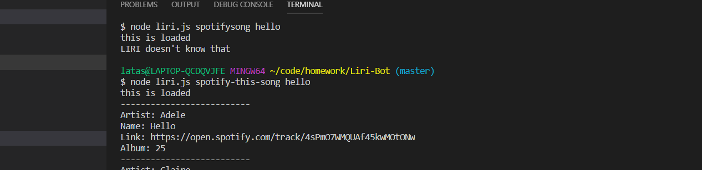
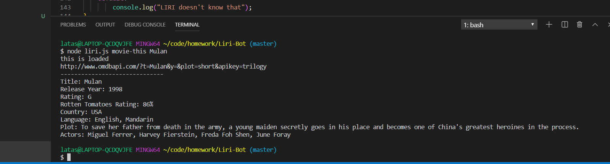
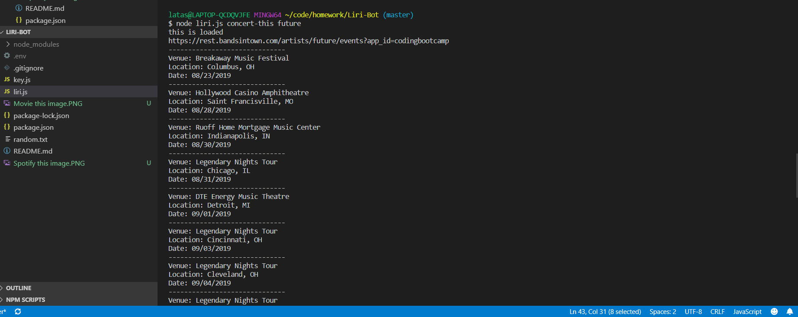
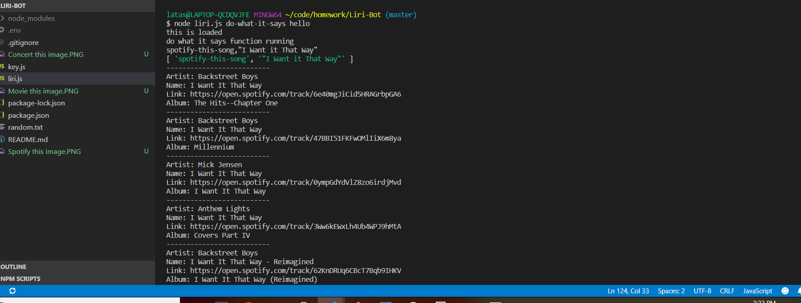

# Liri-Bot
In this application I've created a function to pull information from the Spotify API.  You can input a song name and the termianal will return the artist's name, song name, a preview link of the song from spotify, and the album the song is from.  

I've used the omdbapi url and api to pass through a function. The user can input a movie name the program will return; title of the movie, the year the movie came out, rotten tomatoes rating, the country it was produced in, the language, plot, and actors in the movie.

I took the bands in town url and api to pass through a function.  The user can put artist of interest.  The application will return a venue the artist is playing at, the venue location, and the date of the event.  

I applied a do what it says function so the app knows which funtion to run. 

Technologies used:
-node.js
-spotify api
-ombd api 
-inquirer
-axios
-fs 
